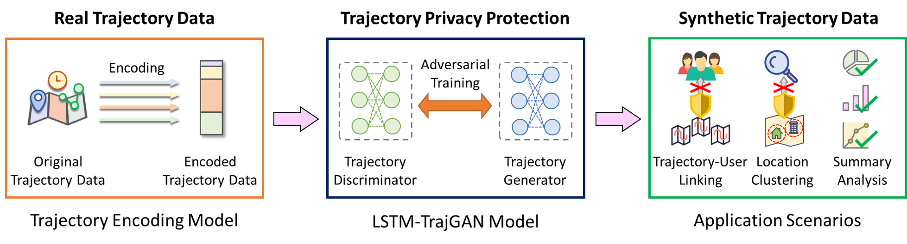
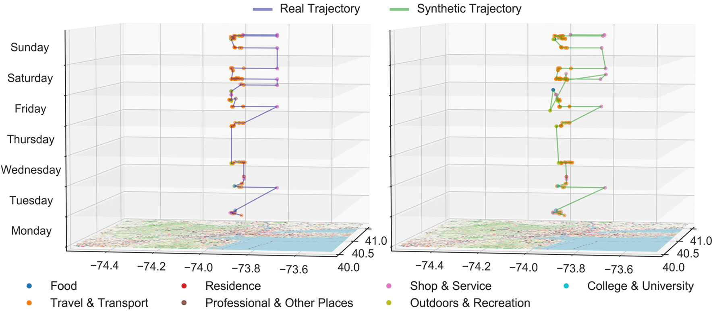
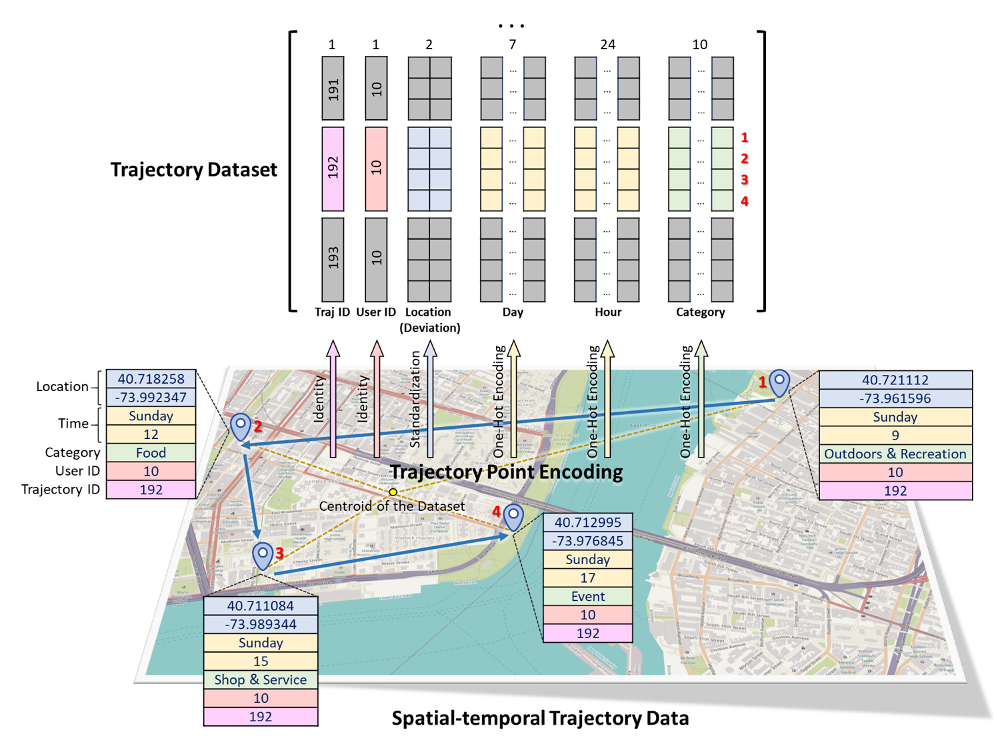

# LSTM-TrajGAN

LSTM-TrajGAN: A Deep Learning Approach to Trajectory Privacy Protection

## Abstract
The prevalence of location-based services contributes to the explosive growth of individual-level location trajectory data and raises public concerns about privacy issues. In this research, we propose a novel LSTM-TrajGAN approach, which is an end-to-end deep learning model to generate privacy-preserving synthetic trajectory data for data sharing and publication. We design a loss metric function TrajLoss to measure the trajectory similarity losses for model training and optimization. The model is evaluated on the trajectory-user-linking task on a real-world semantic trajectory dataset. Compared with other common geomasking methods, our model can better prevent users from being re-identified, and it also preserves essential spatial, temporal, and thematic characteristics of the real trajectory data. The model better balances the effectiveness of trajectory privacy protection and the utility for spatial and temporal analyses, which offers new insights into the GeoAI-powered privacy protection for human mobility studies.

<p align="center">
    
</p>
<p align="center">
    
</p>

## Reference
If you find our code or ideas useful for your research, please cite our paper:

*Rao, J., Gao, S.\*, Kang, Y. and Huang, Q. (2020). [LSTM-TrajGAN: A Deep Learning Approach to Trajectory Privacy Protection](https://drops.dagstuhl.de/opus/volltexte/2020/13047/). In the Proceedings of the 11th International Conference on Geographic Information Science (GIScience 2021), 12:1--12:17.*

```
@InProceedings{rao_et_al:LIPIcs:2020:13047,
  author =	{Jinmeng Rao and Song Gao and Yuhao Kang and Qunying Huang},
  title =	{{LSTM-TrajGAN: A Deep Learning Approach to Trajectory Privacy Protection}},
  booktitle =	{11th International Conference on Geographic Information Science (GIScience 2021) - Part I},
  pages =	{12:1--12:17},
  series =	{Leibniz International Proceedings in Informatics (LIPIcs)},
  ISBN =	{978-3-95977-166-5},
  ISSN =	{1868-8969},
  year =	{2020},
  volume =	{177},
  editor =	{Krzysztof Janowicz and Judith A. Verstegen},
  publisher =	{Schloss Dagstuhl--Leibniz-Zentrum f{\"u}r Informatik},
  address =	{Dagstuhl, Germany},
  URL =		{https://drops.dagstuhl.de/opus/volltexte/2020/13047},
  URN =		{urn:nbn:de:0030-drops-130471},
  doi =		{10.4230/LIPIcs.GIScience.2021.I.12},
  annote =	{Keywords: GeoAI, Deep Learning, Trajectory Privacy, Generative Adversarial Networks}
}
```

## Requirements

LSTM-TrajGAN uses the following packages with Python 3.6.3

- numpy==1.18.4
- pandas==1.1.5
- tensorflow-gpu==1.13.1
- Keras==2.2.4
- geohash2==1.1
- scikit-learn==0.23.2

## Usage

### Data Encoding
<p align="center">
    
</p>

Convert csv files to one-hot-encoded npy files.

```
python data/csv2npy.py --load_path dev_train_encoded_final.csv --save_path train_encoded.npy --tid_col tid
```

Where `load_path` is the path to csv file, `save_path` is the path to save npy file, `tid_col` is the column name of trajectory id.

### Training

Train the LSTM-TrajGAN model using the preprocessed data.

```
python train.py 2000 256 100
```

Where `2000` is the total training epochs, `256` is the batch size, `100` is the parameter saving interval (i.e., save params every 100 epochs).

### Prediction

Generate synthetic trajectory data based on the real test trajectory data and save them to `results/syn_traj_test.csv`.

```
python predict.py 1900
```

Where `1900` means we load the params file saved at the 1900th epoch to generate synthetic trajectory data.

### Test

Evaluate the synthetic trajectory data on the Trajectory-User Linking task using MARC.

```
python TUL_test.py data/train_latlon.csv results/syn_traj_test.csv 100
```

Where `data/train_latlon.csv` is the training data, `results/syn_traj_test.csv` is the synthetic test data, `100` is the embedder size.

### Dataset

The data we used in our paper originally come from [the Foursquare NYC check-in dataset](https://sites.google.com/site/yangdingqi/home/foursquare-dataset).

### References

We mainly referred to these two works:

*May Petry, L., Leite Da Silva, C., Esuli, A., Renso, C., and Bogorny, V. (2020). MARC: a robust method for multiple-aspect trajectory classification via space, time, and semantic embeddings. International Journal of Geographical Information Science, 34(7), 1428-1450.* [Github](https://github.com/bigdata-ufsc/petry-2020-marc)

*Keras-GAN: Collection of Keras implementations of Generative Adversarial Networks (GANs).* [Github](https://github.com/eriklindernoren/Keras-GAN)
